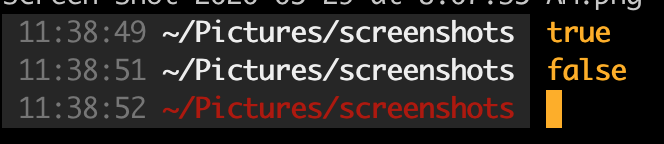
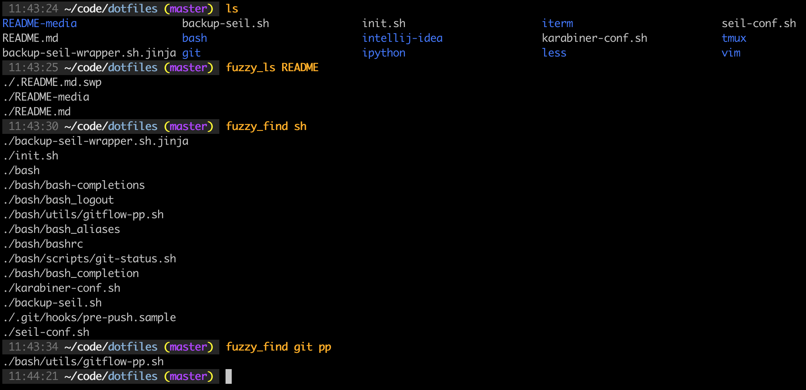
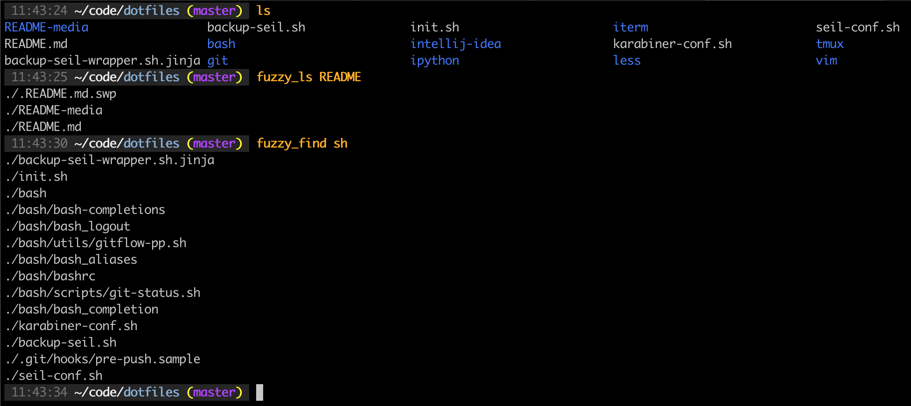
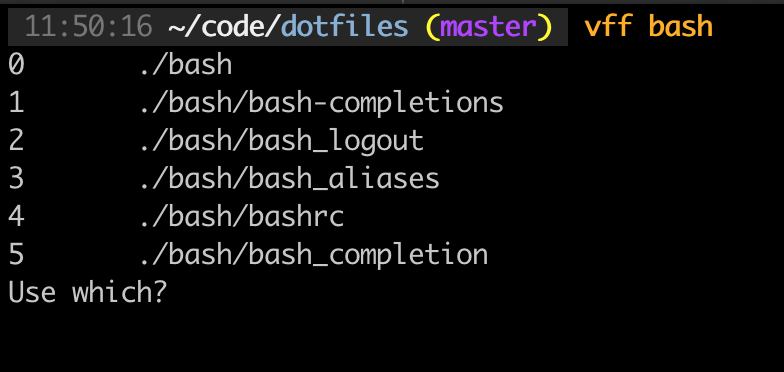

Mieubrisse's Dotfiles Repo
==========================
Features
--------
### Terminal Prompt

* Entries are timestamped
* The entire prompt itself will turn red when the last command failed
* Git directories are highlighted in blue
* Branch name is displayed
* Branch name turns purple when uncommitted changes exist, to remind you to commit
* An indicator is shown for how the local branch compares to the remote (e.g. `-8`), to remind you to pull or push appropriately
* The color of the text you enter is configurable, so you can set different colors on different machines as a subtle visual reminder of the machine you're working on

### Fuzzy File Access
Adds two new commands, `fuzzy_ls` and `fuzzy_find`, which will return files whose names contain the fragments specified:

`fuzzy_ls` searches for files only in the current directory, while `fuzzy_find` recursively searches the current directory and its subdirectories. These have been aliased to `fl` and `ff` for easy access.

### Filtering
Adds a `filter` command that allows users to filter command results linewise:

Multiple disjoint results can be specified with `,` (e.g. `1,3`), and ranges can be specified with `-` (e.g. `7-9`).

NOTE: Requires Python.

### Combining Fuzzy File Access & Filtering
Adds several aliases for combining fuzzy-finding and filtering, e.g. `vff` which runs the equivalent of `vim -O $(fuzzy_find "the" "search" "terms" | filter)` for _incredibly_ easy file access:

### Smart Open 

Adds a `smart_open` command which will attempt to guess the right command to open a file based on the filetype. This can be combined with `fuzzy_ls`/`fuzzy_find` and `filter` to instantly access any file under a directory from anywhere in the filesystem. 

For example, I make frequent edits to the contents of my [someday-maybe directory](https://en.wikipedia.org/wiki/Getting_Things_Done), but its full path is the cumbersome `~/gdrive/someday-maybe`. I've aliased `someday` to the equivalent of `cd ~/gdrive/someday-maybe; smart_open $(fuzzy_find "search" "terms" | filter)`, so that:

* I can enter that directory instantly, from anywhere, with `someday`
* I can open any file in that directory with `someday the search terms`

For more details, see the way that `_smart_open_dir_file` gets used here:

WARNING: You'll feel like you're flying when using this!

### Java

* The `grd` command will search up all parent directories for a `gradlew` file, so that you can run `grd run` if you're four directories deep rather than `../../../../gradlew run`

### cd

* `ls` will be run automatically after `cd`ing into a directory
* `cd 2..` will run `cd ..` twice, `cd 4..` will run `cd ..` four times, etc.

### Command Line Stuff
* "clip FILE" copies the file to the system clipboard (Mac only)
* "ff INPUT" is a shortening of "find -iname '\*INPUT\*'"
* "rgr INPUT" is a shortening of "grep -ir 'INPUT' \*"

### Git Stuff
* When cd'ing into a Git directory, `git fetch` is automatically run in the background
* Branch names can be tab-completed
* Adds a tool for making Gitflow'ing a cinch (complete documentation on [the script itself](https://github.com/mieubrisse/dotfiles/blob/master/bash/utils/gitflow-pp.sh))
* Adds a bunch of aliases, including a huge improvement for `git log`:

### Vim Stuff
* J and K will page down and up respectively
* Pressing + with text highlighted in visual mode will copy it to the system clipboard
